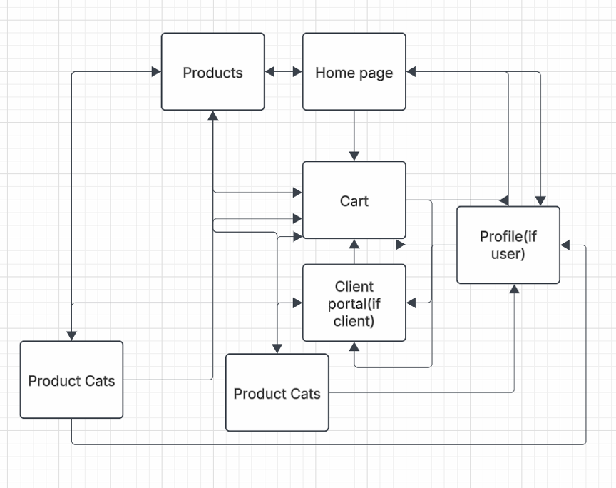
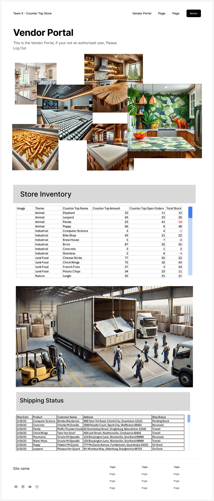
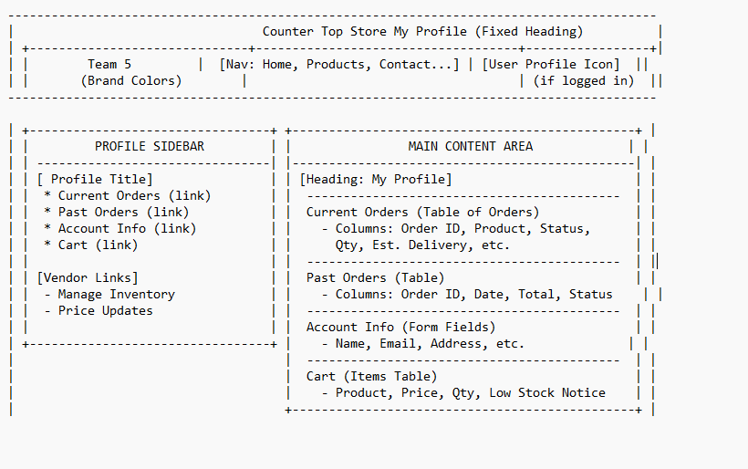

# Web Pages Design - Milestone 4

Lucid chart showing the flow of our webpages:  

<h1>Homepage:</h1>

The <b>Homepage</b> serves as the main entry point for users, providing navigation to various sections of the website.

- A welcoming banner with a brief introduction. 
- Quick links to the <b>Customer Portal</b>, <b>Products Page</b>, and <b>Profile Page</b>. 
- Featured products or promotions. 
- Picture, Memo, Goals.

<h1>Products Page:</h1>

The <b>Products Page</b> displays a catalog of available items with detailed descriptions and purchasing options.

- <b>Product Listings:</b> Images, names, prices, and short descriptions. 
- <b>Filters & Sorting:</b> Allow customers to refine search results by price, category, or popularity. 
- <b>Add to Cart Button:</b> Enables quick purchases. 
- <b>Three categories</b> including pictures, links to product.

<h1>Customer Portal Page:</h1>

The Charts will pull from the database to populate
    

    

Customer Can adjust Inventory and Shipping status.
    

<h1>Profile Page:</h1>

This page allows users (customers) to view and manage:

- Current Orders: A list of active orders with status and delivery details. 
- Past Orders: Completed or canceled orders with dates, totals, and receipts. 
- Account Info: Editable personal data (name, email, address). 
- Cart: Items pending purchase, with stock warnings if needed.

